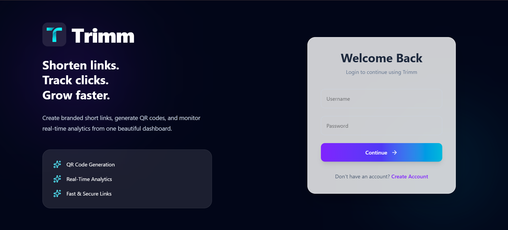
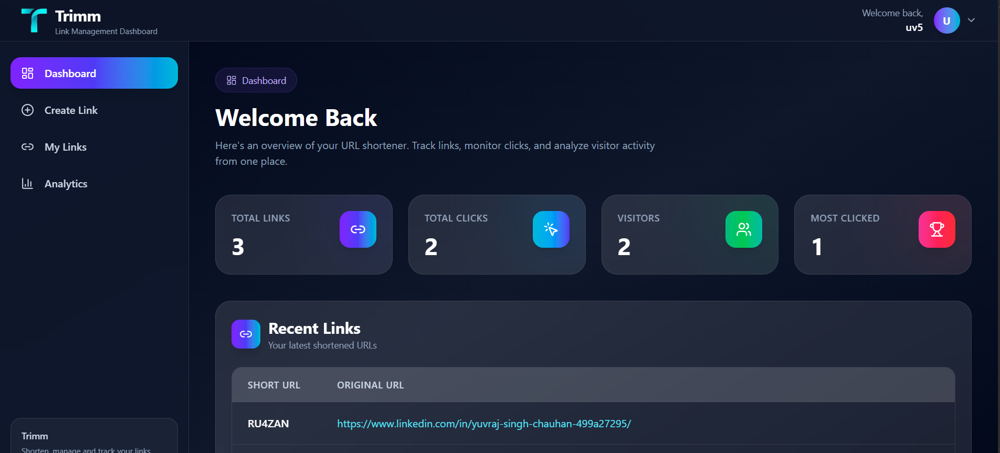
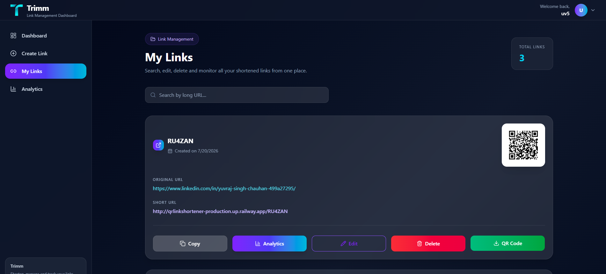
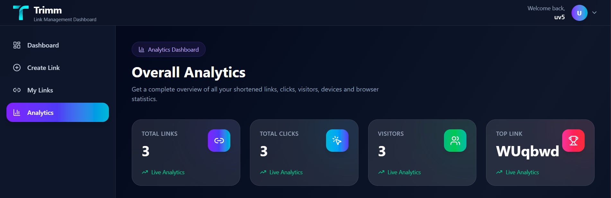
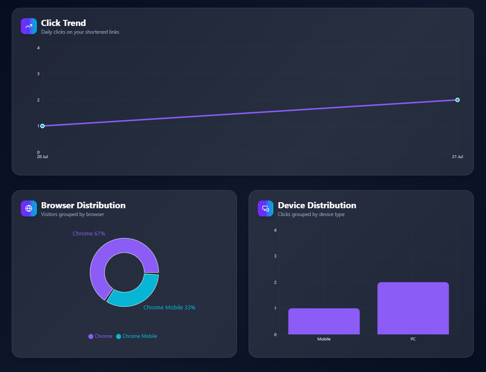
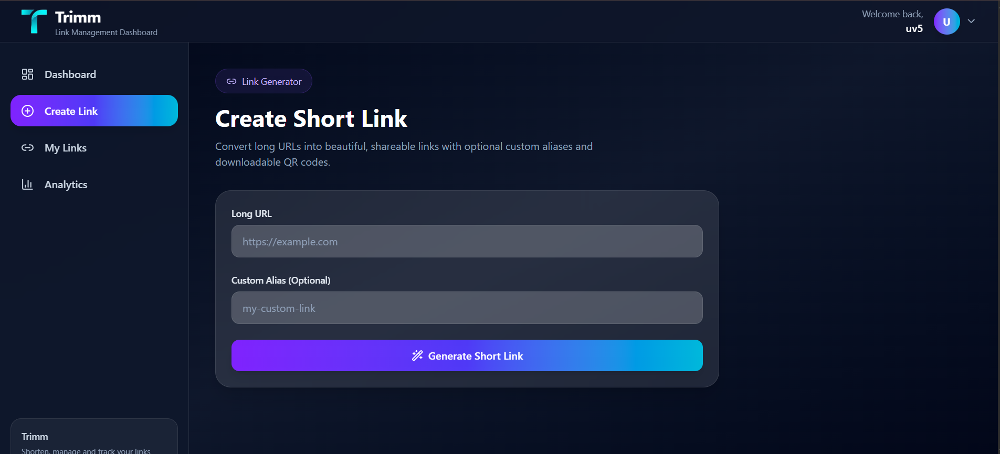

# 🔗 QR Link Shortener

A full-stack URL Shortener and Analytics Platform built with **React**, **Django REST Framework**, **PostgreSQL**, and **Tailwind CSS**. The application allows authenticated users to create short URLs, generate QR codes, track detailed click analytics, and manage all their links through a modern dashboard.

---

## 🚀 Live Demo

**Frontend:**  https://qr-link-shortener-six.vercel.app/
**Backend API:** qrlinkshortener-production.up.railway.app

---

## Screenshots

### Login



### Dashboard



### My Links



### Analytics





### Create Link



---

#  Features

### Authentication

- JWT Authentication
- User Registration
- Secure Login
- Protected Routes
- Automatic Token Authentication

---

### URL Shortener

- Generate Short URLs
- Custom Alias Support
- QR Code Generation
- URL Redirection
- Copy Short URL
- Download QR Code

---

### Analytics

- Total Clicks
- Unique Visitors
- Browser Statistics
- Device Statistics
- Operating System Statistics
- Referrer Tracking
- Recent Click History

---

### Link Management

- Create Link
- View My Links
- Edit Link
- Delete Link
- Search Links
- Pagination

---

## Dashboard

- Total Links
- Total Clicks
- Unique Visitors
- Most Clicked Link
- Recent Links Overview

---

# Tech Stack

## Frontend

- React
- Vite
- Tailwind CSS
- Axios
- React Router
- React Context API
- React Toaster
- React Icons

---

## Backend

- Django
- Django REST Framework
- JWT Authentication
- PostgreSQL
- Cloudinary
- Pillow
- qrcode
- user-agents

---

## Database

- PostgreSQL (Neon)

---

## Deployment

- Frontend → Vercel
- Backend → Railway
- Database → Neon PostgreSQL
- Image Storage → Cloudinary

---

# Project Structure

```
QR_Link_Shortener/

├── backend/
│   ├── analytics/
│   ├── links/
│   ├── users/
│   ├── core/
│   └── manage.py
│
├── frontend/
│   ├── src/
│   │   ├── api/
│   │   ├── components/
│   │   ├── context/
│   │   ├── layouts/
│   │   ├── pages/
│   │   ├── routes/
│   │   ├── services/
│   │   └── assets/
│   └── package.json
│
└── README.md
```
Business logic is separated into a dedicated service layer to keep views clean and improve maintainability.

---

### User

- username
- email
- password

### ShortURL

- user
- long_url
- short_code
- qr_code
- created_at

### ClickAnalytics

- short_url
- ip_address
- browser
- device
- os
- referrer
- clicked_at

---

# API Endpoints

## Authentication

| Method | Endpoint |
|---------|----------|
| POST | /api/users/register/ |
| POST | /api/users/login/ |
| POST | /api/users/refresh/ |

---

## Links

| Method | Endpoint |
|---------|----------|
| POST | /api/links/create/ |
| GET | /api/links/my-links/ |
| PUT | /api/links/{id}/ |
| DELETE | /api/links/{id}/ |

---

## Analytics

| Method | Endpoint |
|---------|----------|
| GET | /api/analytics/{short_code}/ |
| GET | /api/dashboard/ |
| GET | /api/dashboardanalytics/ |

---

# Local Installation

## Clone Repository

```bash
git clone https://github.com/YOUR_USERNAME/Qr_link_shortener.git
```

Backend

```bash
cd backend

python -m venv venv

source venv/bin/activate
```

Windows

```bash
venv\Scripts\activate
```

Install dependencies

```bash
pip install -r requirements.txt
```

Run migrations

```bash
python manage.py migrate
```

Run server

```bash
python manage.py runserver
```

---

Frontend

```bash
cd frontend

npm install

npm run dev
```

---

# Environment Variables

Backend

```env
SECRET_KEY=

DEBUG=

DATABASE_URL=

CLOUDINARY_CLOUD_NAME=

CLOUDINARY_API_KEY=

CLOUDINARY_API_SECRET=

ALLOWED_HOSTS=
```

Frontend

```env
VITE_API_URL=
```

---

# Future Improvements

- Email Verification
- Custom Domains
- Bulk URL Import
- Team Collaboration
- Advanced Analytics Filters

---

# Author

**Yuvraj Singh**

GitHub: https://github.com/Yuvraj2004singhchauhan

---

## ⭐ If you found this project helpful, consider giving it a star!
